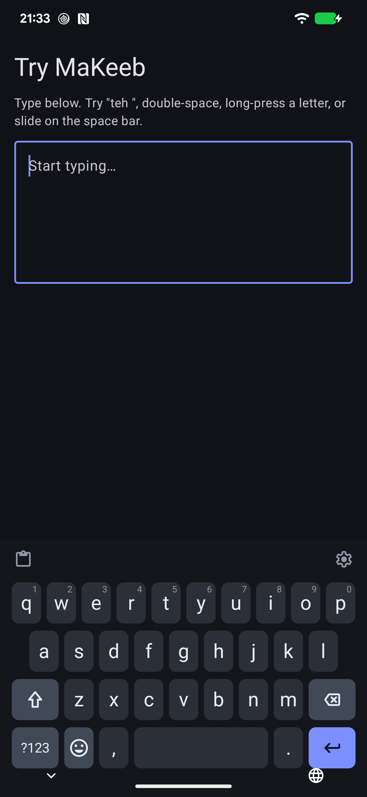
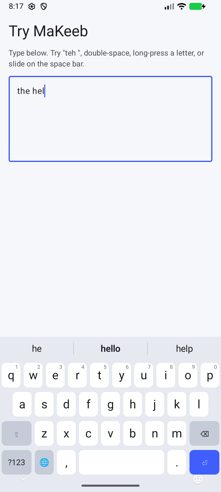
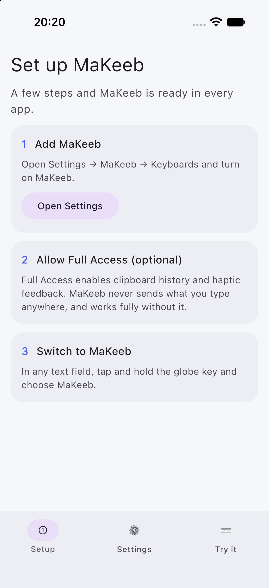

# MaKeeb

A modern third-party keyboard for Android and iOS, built with Kotlin Multiplatform. Typing logic, touch handling, layouts, prediction and theming are shared Kotlin. Android draws the keyboard with Compose inside an `InputMethodService`. The iOS keyboard extension draws the same Kotlin-computed render model natively, because Compose Multiplatform isn't safe to use in app extensions yet.

<p>
  
  
  
</p>

## Status

An early scaffold. The shared engine has working shift and caps lock, auto-capitalization, double-space period, autocorrect with backspace-to-undo, completions, long-press alternates, space-bar cursor slide, backspace repeat, and field-aware layouts (numbers, phone, action key). All of this is covered by JVM tests. Feature planning lives on the [board](.ai/kanban/README.md), one Markdown card per feature in `.ai/kanban`; the next steps are in [.ai/plans/roadmap.md](.ai/plans/roadmap.md).

## Layout

The repository root holds AI tooling, docs, this README and [THIRD_PARTY_NOTICES.md](THIRD_PARTY_NOTICES.md). All source lives in `makeeb/`, which is the Gradle root:

```
makeeb/
  core/       model, common, settings                 foundations
  platform/   host, feedback, clipboard, storage      OS ports + Android/iOS adapters
  engine/     layout, input, touch, dictionary,       shared input logic (commonMain only)
              prediction, gesture, emoji, clipboard
  ui/         theme, components                       Compose design system
  feature/    keyboard, suggestions, emoji,           Compose UI slices
              clipboard, settings, onboarding
  shared/     keyboard, surface, companion            composition roots; the iOS frameworks
  app/        android, ios                            platform wrappers only
  tools/      dictionaries                            build-time: dictionary packs, typing harness
docs/         research, screenshots, dictionaries
```

Layers only depend downwards. Details, rules and the reasoning behind them are in [.ai/instructions.md](.ai/instructions.md).

## Build

Requires JDK 21, the Android SDK (platform 37), and for iOS, Xcode 27 plus [XcodeGen](https://github.com/yonaskolb/XcodeGen).

```
cd makeeb
./gradlew jvmTest                        # shared unit tests
./gradlew :app:android:assembleDebug     # Android APK (first build downloads the pinned AOSP word list)
cd app/ios && xcodegen generate          # then open MaKeeb.xcodeproj, or:
xcodebuild -project MaKeeb.xcodeproj -scheme MaKeeb -sdk iphonesimulator \
  -destination "generic/platform=iOS Simulator" CODE_SIGNING_ALLOWED=NO build
```

To run on a device, copy `makeeb/app/ios/Config/Local.xcconfig.example` to `Local.xcconfig` and set your team; the App Group `group.com.makeeb` must exist for it.

To see the board as a kanban, open it with the [kanban](https://github.com/fonix232/kanban) skill's dashboard.

## License

MaKeeb is MIT-licensed (see [LICENSE](LICENSE)). Bundled third-party data, such as the AOSP English word list, keeps its own licence and notice in [THIRD_PARTY_NOTICES.md](THIRD_PARTY_NOTICES.md).

## Research

- [Open-source keyboards survey](docs/research/open-source-keyboards.md): what exists, feature catalogue and priorities.
- [Platform APIs](docs/research/platform-apis.md): Android IME and iOS keyboard extensions, and what that means for a KMP architecture.
